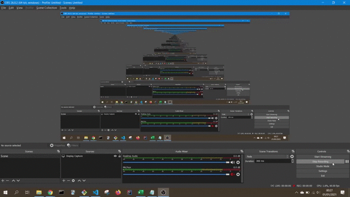
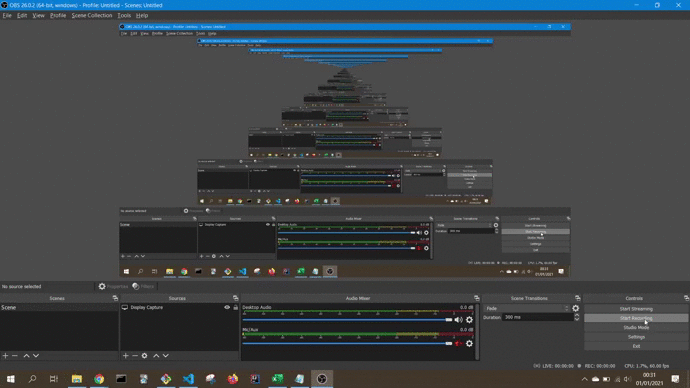
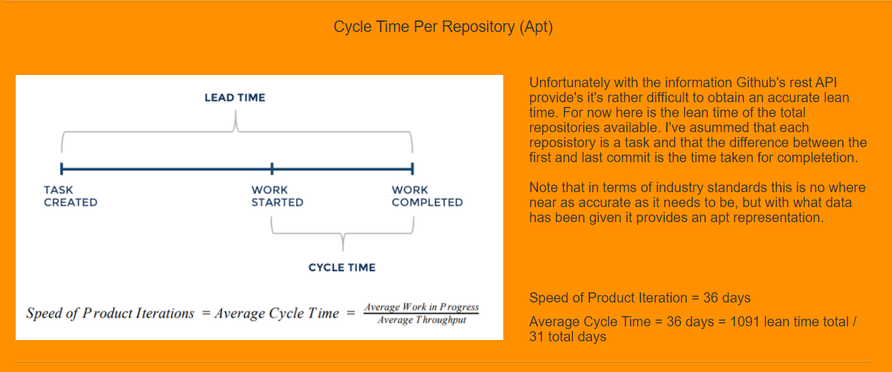
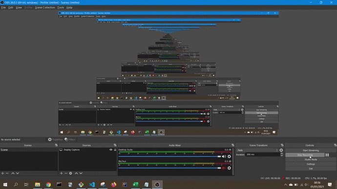

# Github Social Graph
Project for CSU3012 - Software Engineering

Live Version: https://keaneybit.github.io/github-visualiser/

Video Demonstration [Here](https://youtu.be/k0nSKx651aY)

## Instructions to Build and Run Locally
+   **Make sure you have some way of loading localhost**
+   Clone or download the repo: `git clone https://github.com/KeaneyBit/github-visualiser.git`
+   Navigate to the repo: `cd path/to/the/repo/github-visualiser`
+   Make sure you are in  `github-visualiser/`
+   Run your localhost
+   Navigate to link from terminal or: [http://127.0.0.1:5500/index.html](http://127.0.0.1:5500/index.html)

## Demonstration Gif

## Features
### Account Details by API
+   Used Github REST API to load account details
+   Account Image, Username and other essential details shown
+   Use of authentication token in searching allows for many more API requests
+   Ability to view both public and private repositories as long as adequate token provided
+   Inaccurate details while searching will result in pretty error message explaining isse (wrong username or token)
+   Authentication will effect what results are displayed
+   

**Note**. **Graphs will take a few moments to load depending on internet speed and strength of computer.**
### Pie Chart of Most Popular Languages
+   Dynamic graph
+   Shows the most popular languages used by an account in Pie Chart Format
+   Ability to pick and adjust piechart based on what languages you wish to view
+   Each section of the piece chart is coloured different
+   Highlights the chart when hovering over, displaying a number a value for each language
+   

### Stepped Graphs Showing Commits per Repository
+   Uses Chart.js to create a stepped line-graph of each accounts repository commits
+   Shows total commits over time
+   Date of commit displayed on x-axis, y-axis displayed total
+   Hovering over commit dot will display commit date
+   

### Cycle Time
+   More Apt approached to measuring software engineering
+   Calculates cycle time of each repository
+   Calculates total cycle time based on first and last commits
+   Useful images explaining concept of cycle time

### Scatter Graph of Commits Timeline
+   Shows amalgamated timeline of commits, sorted by day of the week and hour
+   Hours on the y-axis, days on the x-axis
+   Useful for determining what times a developer is most active during the workweek
+   The most an individual commits the darker the dot becomes

